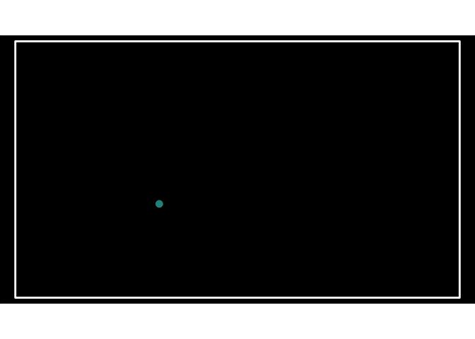
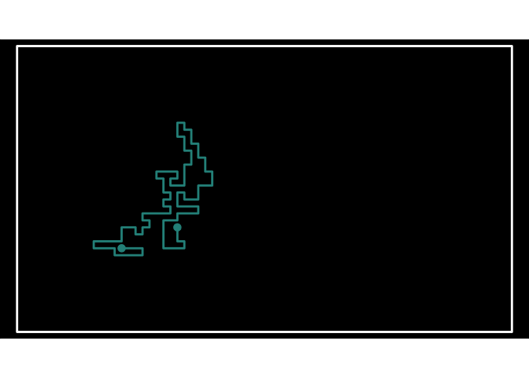
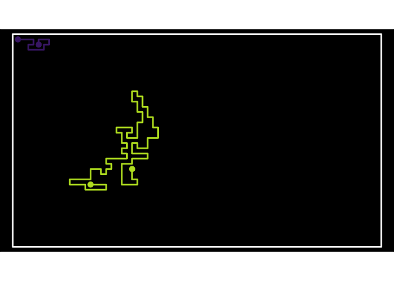
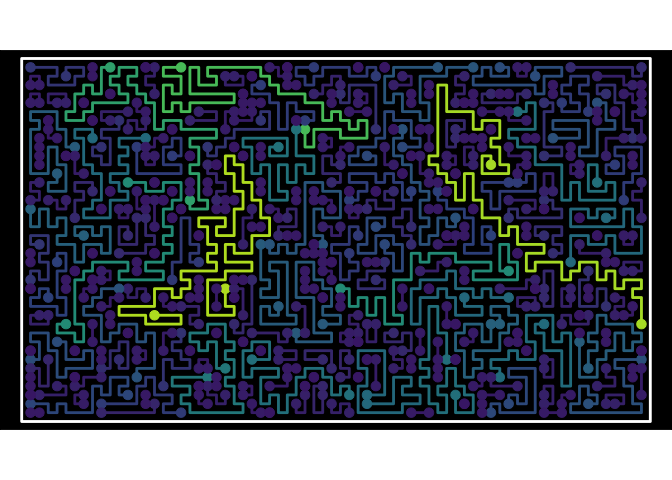
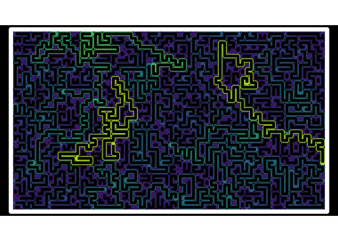
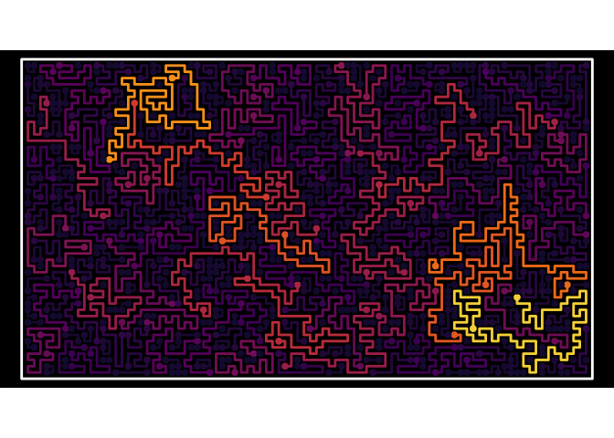

<!-- README.md is generated from README.Rmd. Please edit that file -->

# SnakeArts

<!-- badges: start -->
<!-- badges: end -->

Make a space

``` r
space <- Space$new(nrows = 40, ncol=70)
```

Start a Snake!

``` r
space$new_snake()
space$show(linewidth=1) + snake_palette("E")
```

<!-- -->

extend the head in a random direction, as long as the space is available

``` r
space$move_head()
space$show(linewidth=1) + snake_palette("E")
```

<!-- -->

Grow the snake until it’s trapped

``` r
space$grow_snake()
space$show(linewidth=1) + snake_palette("E")
```

<!-- -->

Make another one… and one more The longer the snake, the brighest it
gets

``` r
space$new_snake()
space$grow_snake()
space$show(linewidth=1) + snake_palette("E")
```

<!-- -->

Fill up the whole space

``` r
space$fill_space()
space$show(linewidth=1) + snake_palette("E")
```

<!-- -->

So pretty!

``` r
space$fill_space()
space$show(linewidth=3) + snake_palette("E")
```

<!-- -->

``` r
space <- Space$new(50,90)
space$fill_space()
space$show(linewidth=1,
           dotsize=2) + snake_palette("B")
```

<!-- -->
